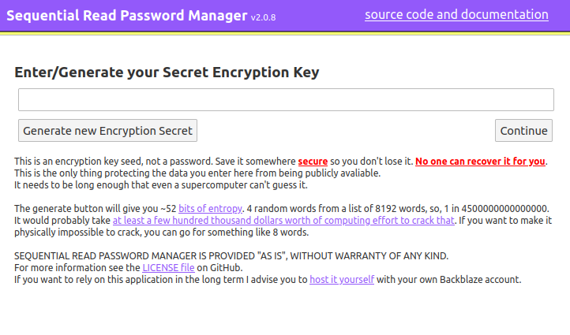
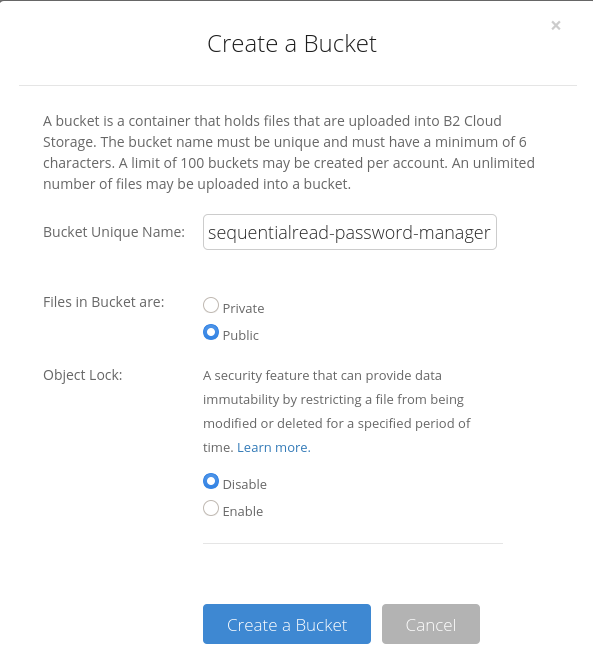

# SequentialRead Password Manager

This is a Golang / HTML5  / vanilla JavaScript web-application which stores encrypted text files in three places:

 - `localStorage` in the browser
 - on disk next to the HTTP server binary
 - in a Backblaze B2 bucket



[Try it! (https://pwm.sequentialread.com) ](https://pwm.sequentialread.com)

OR run it yourself in docker:

```
docker run \
  -p 8073:8073 \
  -v "/Users/exampleUser/Desktop/encrypted-passwords:/data" \
  -e SEQUENTIALREAD_PWM_BACKBLAZE_ACCESS_KEY_ID=EXAMPLE77f599784EXAMPLE \
  -e SEQUENTIALREAD_PWM_BACKBLAZE_SECRET_ACCESS_KEY=EXAMPLEEXAMPLEEXAMPLEEXAMPLEKEY \
  -e SEQUENTIALREAD_PWM_BACKBLAZE_BUCKET_NAME=sequentialread-password-manager \
  -e SEQUENTIALREAD_PWM_BACKBLAZE_BUCKET_REGION=us-west-000 \
  sequentialread/sequentialread-password-manager:2.0.0
```

See "Hosting it yourself" for more information.

## Security

First and foremost, the application is easy to audit since it has minimal dependencies: 

 - sjcl.js, AKA the Stanford JavaScript Crypto Library
 - [MyEtherWallet/scrypt-wasm](https://github.com/MyEtherWallet/scrypt-wasm)
   - This thing simply compiles the [scrypt hash function from the Rust standard library](https://docs.rs/rust-crypto/0.2.36/crypto/scrypt/index.html) into a Web Assembly binary.
 - [qntm/base32768](https://github.com/qntm/base32768), a boutique binary encoding which is used to package the Scrypt WASM binary into a [WebWorker](https://developer.mozilla.org/en-US/docs/Web/API/Web_Workers_API/Using_web_workers).

You can re-produce the sjcl.js I am using like so: 

```
git clone https://github.com/bitwiseshiftleft/sjcl
cd sjcl
./configure --without-all --with-codecBytes --with-sha256 --with-codecBase64 --with-codecHex --with-codecString --with-cbc  --with-hmac 
make
```

There is nothing that pulls in dependencies, no bundling step, etc. There is only one place where `XMLHttpRequest` is created, and the request body is encrypted in the same place. Same goes for `localStorage`.

It was designed that way to strengthen the claim that "everything it sends out from the javascript VM is AES encrypted with the key you chose".

## High Avaliability by Design

 It uses the [Service Worker API](https://developer.mozilla.org/en-US/docs/Web/API/Service_Worker_API/Using_Service_Workers) to ensure that even if my server goes down, the app still loads.

 It also has its own Backblaze credential with access to the bucket, so you can still access your passwords from a new device if my server goes down.

 It will also work even if your device has no internet connection, of course any changes will not be sent to the server or to Backblaze until you connect again and prompt the app to update the file again.

 It uses a naive approach to keep all 3 data stores in sync: When writing, it will attempt to write to all 3 and tolerate failures. When reading, it will compare the `lastUpdated` timestamps on all versions that it received, and if they don't match or if one is missing, it will issue a `PUT` with the most up-to-date version.

 That means if you happen to make conflicting changes, there is no real conflict resolution. The latest one wins.

## Encryption Key User Interface Disclaimer

You are allowed to use whatever seed you want for your AES key. If you pick a weak seed and get hacked, that is your fault. The application warned you about it. It was even red, bold and underlined!

The application includes a timestamp + mouse-movement + SHA256 + `crypto.getRandomValues()` based entropy generator to create a secure passphrase, encoded in base 8192 as 4 english words. An example:

`motel behave sits parcel`

Assuming the attacker had access to the ciphertext, they would have to guess a 1 in 2^53 Scrypt hash. The scrypt parameters used are: 

```
N = 16384  // CPU and Memory cost factor.
r = 32     // BlockMix block size, increases memory requirement linearly.
p = 1      // parallelism factor
dklen = 32 // output key length in bytes
```

According to the cost analysis from the [original scrypt paper](http://www.tarsnap.com/scrypt/scrypt.pdf) this puts the monetary cost associated with brute-force cracking one of these keys in the millions of dollars. That paper is quite old now though, so I would adjust it down to hundreds of thousands of dollars to account for the advancement in scrypt ASIC / GPU chip production associated with Cryptocurrency mining. That said, I don't know if existing Litecoin ASICs could be retooled to crack these passwords. I doubt it, because the scrypt parameters I am using will demand a LOT more memory than Litecoin mining will. So probably those ASICs would not be able to complete any of these hashes. 

Also, keep in mind that casual remote attackers probably won't even have access to the ciphertext anyway, since they would have to sweep your browser's localstorage or get it from Backblaze somehow. (They can't list the bucket without gaining access to my Backblaze account). I just put a scary disclaimer on the app since I don't want to be holding people's weakly encrypted password data.

If you are extremely paranoid and want to make sure that its physically impossible to brute force your password, just use 8 words words. That will give you over 100 bits of entropy which should be more than enough.


## License

 This software is provided "AS-IS" under the MIT license. For more information see the `LICENSE` file.

## Hosting it yourself

When you are creating the backblaze bucket, make sure you enable "Files in bucket are public". 



You will also have to enable CORS on the bucket.  Enabling CORS in the UI will not work, you have to manually enable it on the bucket using the backblaze API. 

```
BACKBLAZE_KEY_ID=""
BACKBLAZE_SECRET_KEY=""
BUCKET_NAME="sequentialread-password-manager"

AUTH_JSON="$(curl -sS -u "$BACKBLAZE_KEY_ID:$BACKBLAZE_SECRET_KEY" https://api.backblazeb2.com/b2api/v1/b2_authorize_account)"
AUTHORIZATION_TOKEN="$(echo "$AUTH_JSON" | jq -r .authorizationToken)"
ACCOUNT_ID="$(echo "$AUTH_JSON" | jq -r .accountId)"
API_URL="$(echo "$AUTH_JSON" | jq -r .apiUrl)"

BUCKET_ID="$(curl -sS -H "Authorization: $AUTHORIZATION_TOKEN" "$API_URL/b2api/v2/b2_list_buckets?accountId=$ACCOUNT_ID&bucketName=$BUCKET_NAME" | jq -r .buckets[0].bucketId)"

curl -X POST -H "Authorization: $AUTHORIZATION_TOKEN" -H "Content-Type: application/json" "$API_URL/b2api/v2/b2_update_bucket" -d '{
      "accountId": "'"$ACCOUNT_ID"'",
      "bucketId": "'"$BUCKET_ID"'",
      "corsRules": [
        {
          "allowedHeaders": [ "*" ],
          "allowedOperations": [
            "s3_head",
            "s3_get",
            "s3_put"
          ],
          "allowedOrigins": [ "*" ],
          "exposeHeaders": null,
          "corsRuleName": "s3DownloadFromAnyOrigin",
          "maxAgeSeconds": 3600
        }
      ]
}'


```


You also have to create the backblaze application key using the API because the web interface wont let your manually select the specific capabilities for the key.

Creating the Backblaze application key which is limited to the bucket & can't list the files in the bucket:

```
BACKBLAZE_KEY_ID=""
BACKBLAZE_SECRET_KEY=""
BUCKET_NAME="sequentialread-password-manager"
KEY_NAME="sequentialread-password-manager"

AUTH_JSON="$(curl -sS -u "$BACKBLAZE_KEY_ID:$BACKBLAZE_SECRET_KEY" https://api.backblazeb2.com/b2api/v1/b2_authorize_account)"
AUTHORIZATION_TOKEN="$(echo "$AUTH_JSON" | jq -r .authorizationToken)"
ACCOUNT_ID="$(echo "$AUTH_JSON" | jq -r .accountId)"
API_URL="$(echo "$AUTH_JSON" | jq -r .apiUrl)"

BUCKET_ID="$(curl -sS -H "Authorization: $AUTHORIZATION_TOKEN" "$API_URL/b2api/v2/b2_list_buckets?accountId=$ACCOUNT_ID&bucketName=$BUCKET_NAME" | jq -r .buckets[0].bucketId)"

curl -X POST -H "Authorization: $AUTHORIZATION_TOKEN" -H "Content-Type: application/json" "$API_URL/b2api/v2/b2_create_key" -d '{"accountId": "'"$ACCOUNT_ID"'", "capabilities": ["listBuckets", "readFiles", "writeFiles"], "keyName": "'"$KEY_NAME"'", "bucketId": "'"$BUCKET_ID"'"}'

```

My bucket's S3-compatible-API endpoint (displayed under the bucket in the backblaze web interface) was `s3.us-west-000.backblazeb2.com`.

When setting the environment variables, I set them like this: 

```
SEQUENTIALREAD_PWM_BACKBLAZE_BUCKET_NAME=sequentialread-password-manager
SEQUENTIALREAD_PWM_BACKBLAZE_BUCKET_REGION=us-west-000
SEQUENTIALREAD_PWM_BACKBLAZE_ACCESS_KEY_ID=0003ea77f5997840000000015
SEQUENTIALREAD_PWM_BACKBLAZE_SECRET_ACCESS_KEY=EXAMPLEEXAMPLEEXAMPLEEXAMPLE
```